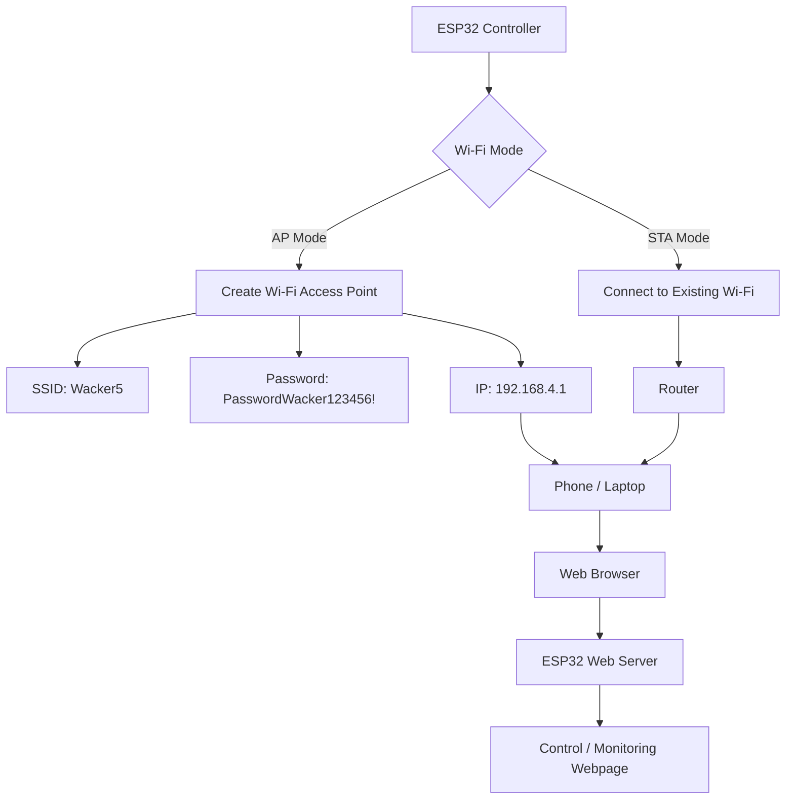
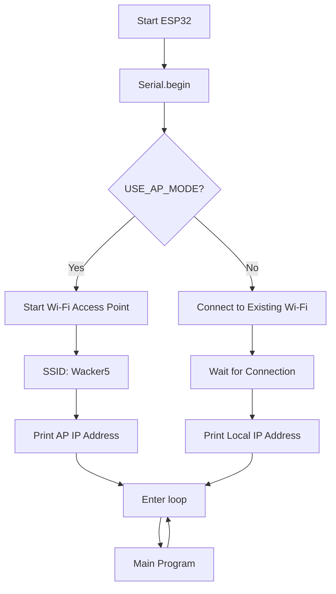
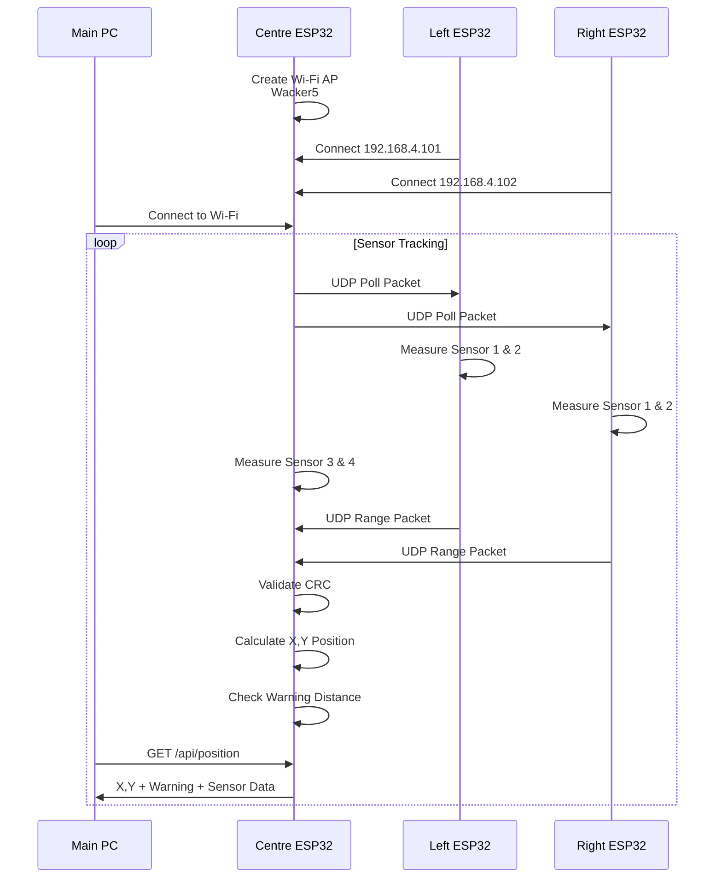

---
tags:
  - eng3000
  - minutes
  - scrum
date: 2026-08-07
sprint:
minute_taker: Alleluya Hamisi
---

# 🛠️ ENG3000 — Scrum Minutes: Week 2

## Project Overview
- **Project name:** Whack a Moll
- **Course:** ENG3000
- **Sprint / Week #:** 2
- **Minute Taker:** Alleluya Hamisi

## Attendance
| Name                    | Student ID | Discipline | Role This Week | Attendance (P/A) |
| ----------------------- | ---------- | ---------- | -------------- | ---------------- |
| Alleluya Hamisi (Alley) | 48455032   | SE         | Minutes Taker  | p                |
| Matthew Thompson        | 48234559   | SE         | Scrum Master   | p                |
| Fouad Ayoub             | 48421650   | SE         | Engineer       | p                |
| Cammilus John Baptist   | 48322288   | EE         | Engineer       | p                |
| Shreenidhi Arunachalam  | 48552453   | SE         | Engineer       | P                |

## Scrum Board Snapshot
![[Dashboard.png]]

| Task ID                          | No. Subtasks | Project Status                                       | Issues / Solution                                                                                                                                                                                                              | Assignee                |
| -------------------------------- | ------------ | ---------------------------------------------------- | ------------------------------------------------------------------------------------------------------------------------------------------------------------------------------------------------------------------------------ | ----------------------- |
| Code GUI                         | 3            | 1 subtask done  2 Subtask in progress          | There was communication conflicts as we had 2 ui designes made.  We resolved this by making both frontend developers merge the best components of their Designs and established a discord channel specifically for them. | Fouad  Shreenidhi |
| Program ESP32                    | 2            | 1 sub task in progress  1 sub task is complete | We had requirements change following a few inquires from the students.  - While it was minor changes we were able to adjust our BOM and was still able to make a access point for the esp32 and website api              | Matthew                 |
| Game Logic (Backend)             | 6            | 2 sub tasks in progress  2 sub tasks complete  | Conflicting Ui designs made the game logic need to change  - Adapting from plain html to CSS and HTML combination  - Backend currently independent from frontend                                                   | Alley                   |
| Electrical Design & Proto Typing | 3            | 1 sub task in progress                               | Changing costs of the BOM required further changes to the PCB designs                                                                                                                                                          | Cammilus                |

## Sprint Backlog (subtasks committed this sprint)
| Sub Task                                        | Main Task                        | Estimation (days) | Assignee           |
| ----------------------------------------------- | -------------------------------- | ----------------- | ------------------ |
| Redesign & connect HTML scoreboard with new GUI | Code GUI                         | 7                 | Shreenidhi + Fouad |
| Redesign & connect HTML lose/win screen         | Code GUI                         | 7                 | Shreenidhi + Fouad |
| Redesign Scoring /Scoreboard system (Backend)   | Game logic (Backend)             | 7                 | Alley              |
| Connect Api connection with esp32 (Backend)     | Game logic (Backend)             | 7                 | Alley              |
| Create a sensor logic for the esp32             | Program ESP32 Access Point       | 7                 | Matthew            |
| Start wiring the ESP32 for testing next week    | Electrical Design & Proto Typing | 7 - 10            | Cammilus           |

## Sprint Actions (goals for this week)
- [ ] Add LIves System
- [ ] Loss / Win Function
- [ ] Add Visual Damage Indicator
- [ ] GUI levels & Win/Condition Screen
- [ ] Design Sensor Stands 

## Meeting Notes
> Client requirements, design decisions, budget/scope discussion, constraints raised.
- There are confecting files so we will need to either merge or remove files that are not needed
- The pcb is going to take a few weeks to design and then order which will mean that we need to use the existing esp32 provided to test for week 5
- The access point is currently working but sometimes the device is not connecting with other devices so we might need to improve it when we get the chance
- We need to keep each other accountable and also updated to ensure everyone feels like their contributing and are not left out to dry

## Testing Updates
| Test ID | Component Tested                          | Result                                                                                                                                                                                                                                                             | Owner                                       | Status   |
| ------- | ----------------------------------------- | ------------------------------------------------------------------------------------------------------------------------------------------------------------------------------------------------------------------------------------------------------------------ | ------------------------------------------- | -------- |
| T-01    | Distance sesnor (1m)                      | Pass                                                                                                                                                                                                                                                               | Matthew, Fouad                              | Complete |
| T-02    | Distance sesnor (1.5m)                    | Partical Pass (Sensor have limited accuracy but it does detect)                                                                                                                                                                                                 | Alley, Cammilus, Shreenidhi                 | Complete |
| T-03    | Distance sesnor + Laptop (1.5m)           | Pass (Sensores picked up way more accurartly with metal object)                                                                                                                                                                                                 | Matthew, Fouad                              | Complete |
| T-04    | Sensor Detection + Wall background (1.5m) | Pass  (The sensor picked up better with a wall compared to with only human body)                                                                                                                                                                                | Alley, Cammilus, Shreenidhi                 | Complete |
| T-05    | Sensor Blind Spot (1.5m)                  | - The sesor has a blind spot for detecting human when too close - Sensors can only be roughly 5cm to the right or left before it stops detecting - Sensors have a varying blind spot depending on the person and the object being carried and the background | Matthew, Fouad, Alley, Cammilus, Shreenidhi | Complete |

## Esp32 Backend / Technical Illustration

**Access Point Draft Workflow (Mermaid):**

**Access point Diagram (Mermaid):**

    
	  
	  
*WIFI & UDP Diagram (Mermaid):**

Simplified Box Diagram
![[Sensordiagram.png.png]]
## Sprint Review
- Everyone is expected to have something prior to the Tuesday workshop
- We will be reviewing the UI code to ensure at least some components have been designed and is ready to code or has at least a skeleton or sketch out of the potential code
- The PCB isn’t expected to be complete, but a sketch or potential design is expected to be drafted
- The Access point isn’t expected to be complete since the ESP32 currently doesn’t have an antenna, but the skeleton of the code is expected to be ready for our prototype PCB to be able to use in the coming fortnight workshop

## Sprint Retrospective
- What went well:
	- We were all able to voice our opinion's and provide good advice on the changing customer requirements
	- We were all able to divide tasks for areas we believe were most confident within
- What to improve:
	- Communication between other roles or tasks so that we are not too tunnel focused but view the overal project
- Support needed from other members:
	- No member has voiced for help and instead all members are on track

## Next Meeting
- **Date:** 14/08/2026
- **Location/Platform:** Discord

---
