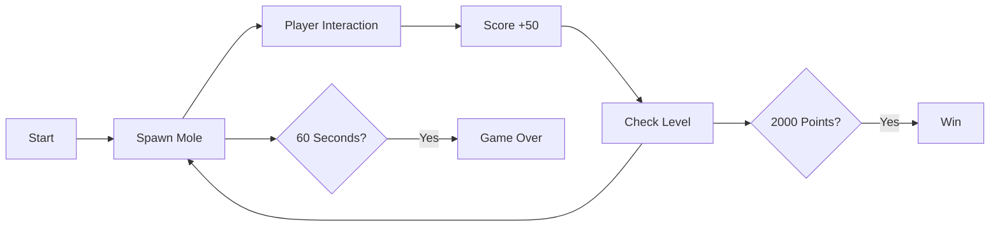
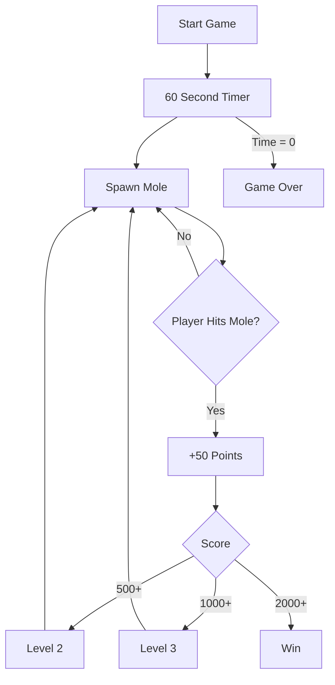

---
tags:
  - eng3000
  - minutes
  - scrum
date: 2026-08-14
sprint: Week 3
minute_taker: Alleluya Hamisi
---

# 🛠️ ENG3000 — Scrum Minutes: Sprint {{title}}

## Project Overview
- **Project name:**
- **Course:** ENG3000
- **Supervisor:**
- **Sprint / Week #:** 3
- **Minute Taker:** Alleluya Hamisi

## Attendance
| Name                    | Student ID | Discipline | Role This Week | Attendance (P/A) |
| ----------------------- | ---------- | ---------- | -------------- | ---------------- |
| Alleluya Hamisi (Alley) | 48455032   | SE         | Minutes Taker  | p                |
| Matthew Thompson        | 48234559   | SE         | Engineer       | p                |
| Fouad Ayoub             | 48421650   | SE         | Engineer       | p                |
| Cammilus John Baptist   | 48322288   | EE         | Engineer       | p                |
| Shreenidhi Arunachalam  | 48552453   | SE         | Scrum Master   | P                |

## Scrum Board Snapshot

![[Dashboard 2.png]]

| Task ID                          | No. Subtasks | Project Status                                      | Issues / Solution                                                                                                                                                                                                                                                                                                          | Assignee                |
| -------------------------------- | ------------ | --------------------------------------------------- | -------------------------------------------------------------------------------------------------------------------------------------------------------------------------------------------------------------------------------------------------------------------------------------------------------------------------- | ----------------------- |
| Code GUI                         | 3            | 3 subtask done  2 Subtask Newly Created       | - There was no main problem other then being finished with the intitial design.  - This lead to us asking for more animations and other final touches before the MVP is due.                                                                                                                                         | Fouad  Shreenidhi |
| Program ESP32                    | 2            | 2 sub task Complete  1 sub task Newly Created | - We had limitation with the sensors and also conistency.   - This lead to more testing then coding since we were focused on understanding the cause of the inconsistency                                                                                                                                            | Matthew                 |
| Game Logic (Backend)             | 6            | 2 sub tasks in progress  2 sub tasks complete | The changing of the frontend required updating the backend. Alley took a bit of time designing the system before coding leading to the rest of the front endteam waiting a bit  This was resolved by making sure he communicated with the group more and made concerns like his busy schedule aware to the team.  | Alley                   |
| Electrical Design & Proto Typing | 3            | 1 sub task in progress                              | Focused on wiring up and helping Matthew mainly due to the PCB ordering taking time.  Instead of just waiting we have request on moving to the next steps like 3D designing so we can print things like a stand and tunnel to reduce inconsisnecy for the sensors.                                                   | Cammilus                |

## Sprint Backlog (subtasks committed this sprint)
| Sub Task                                     | Main Task                        | Estimation (days) | Assignee           | Done?                     |
| -------------------------------------------- | -------------------------------- | ----------------- | ------------------ | ------------------------- |
| Add LIves System                             | Code GUI                         | 7                 | Shreenidhi + Fouad | Done                      |
| Add Visual Damage Indicator                  | Code GUI                         | 7                 | Fouad              | Done                      |
| GUI levels & Win/Condition Screen            | Code GUI                         | 7                 | Shreenidhi         | Done                      |
| Loss / Win Function                          | Game logic (Backend)             | 7                 | Alley              | Done                      |
| Connect Api connection with esp32 (Backend)  | Game logic (Backend)             | 7                 | Alley              | In progress (almost done) |
| Connect Backend to esp32 logic               | Program ESP32 Access Point       | 7                 | Matthew            | in Progress (nearly done) |
| Design PCB & Sensor Stands                   | Electrical Design & Proto Typing | 14                | Cammilus           | Done                      |
| Start wiring the ESP32 for testing next week | Electrical Design & Proto Typing | 7                 | Cammilus           | Done                      |

## Sprint Actions (goals for this week)
- [ ] Fix new HTML/CSS to align with the existing ESP32 game logic
- [ ] Add Different type of moles
- [ ] Add Speed increase depending on level
- [ ] Create Simple components for the MVP (Stand)
- [ ] Add Multi Core Calculation (Building block toward triangulation)

## Meeting Notes
> There was a lot of work that was completed this week.
- The main concern was the lack of time that everyone could find to do the next sections especially since there larger and more complex tasks highlighting that the next subtasks may be our main focus as we prepare for the MVP
- We highlighted there is a lack of testing and we might focus on testing everything before week 5 meeting
- We all Agreed to show up on week 5 especially since before 3pm which is our elected time for the presentation
- We agreeed we would only talk about our sections in the meeting if asked

## Testing Updates
| Test ID | Component Tested                                                                                                                                                                                                                                                       | Result       | Owner                              | Status         |
| ------- | ---------------------------------------------------------------------------------------------------------------------------------------------------------------------------------------------------------------------------------------------------------------------- | ------------ | ---------------------------------- | -------------- |
| T-06    | Sensor blind spot  (The sensors reduce their reliablilty when you remain in the middle compared to on the right or left of the sensors)                                                                                                                             | Fail         | Mathew, Alley                      | 🟡 In progress |
| T-07    | Sensors Blind spot + Laptop (Even with a metal object the sensors do not like players remaining in the middle and would prefer on the edge)                                                                                                                         | Fail         | Matthew, Foud                      | 🟡 In progress |
| T-08    | Sensors Blind Spot + 2 players (The sensors would select the most active player and belive that was the area the player was last seen although if both players are moving the same then the system would crash and try and move the mouse to both creating a error) | Fail         | Matthew, Shreenidhi, Cammilus      | 🟡 In progress |
| T-09    | Sensor data relay to web (The sensor data is relaying to the api)                                                                                                                                                                                                   | Pass         | Matthew, Alley                     | Done           |
| T-10    | Sensor data makes the player move (Currently the sensors can indicate but isn't very good at actually moving the player in a coordinated manner)                                                                                                                    | Partial Pass | Mathew, Foud, Shreenidhi, Cammilus | 🟡 In progress |

## Game Logic

Game Logic Diagram (Mermaid):**

The system is just a temporary MVP version of the game logic JavaScript file, most likely turn into a state machine or a more modular design after the initial feedback.

**Basic Leveling & Point System (Mermaid):**

A simple leveling system data flow chart that showcases the relationship between the mole and the objective/leveling system.
## UI Diagrams

![[skeletonui.png.png]]
Basic concept Game HTML & CSS

![[skeletonUI2.png.png]]
Initial skeleton version of the MVP prior to merging both UI's

![[loseCond.png.png]]

![[winCond.png.png]]

Skeleton win & Lose condition UI

![[ImprovedUI.png.png]]
Alternative UI that was designed without a JS backend

## Sprint Review
- We expect that next week may be too busy for us to do major changes and will mainly focus on doing minor improvements if possible or attempting to fix / merge existing features that just need minor changes.
- Ta's advice was to ensure everyone tested their body for the sensor just incase the sensor has limitations like different clothing, number of people, changing background, height of the sensor and lack of metal reflection.

## Sprint Retrospective
- What went well:
	  - We now have a funtional UI
	  - Working backend and also successful API relay
	  - We have finally designed an MVP but there is just minor fixes that need to be done before presenting
- What to improve:
	  - Sensor detection need to improve
	  - UI needs to improve since right now there is no animation or anything other than a cool background
	  - There needs to be a cone of something to reduce the sensors spamming error or being incorrect
- Support needed from other members:
	  -  No issue has been brought up

## Next Meeting
- **Date:** 21/08/2026
- **Location/Platform:** Discord

---
