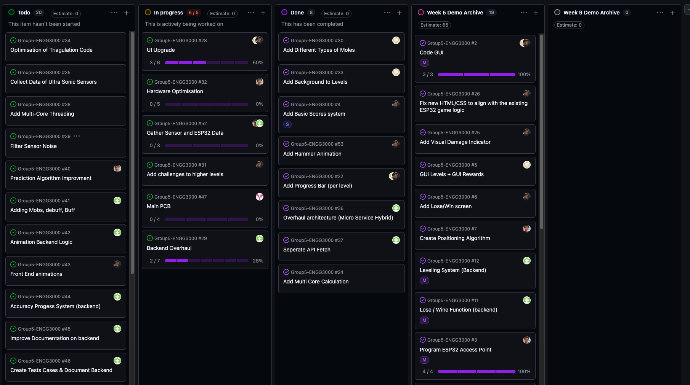
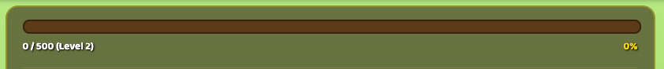
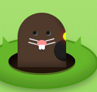
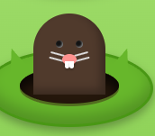
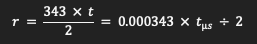
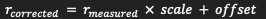
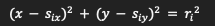
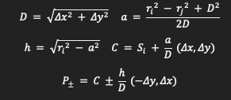
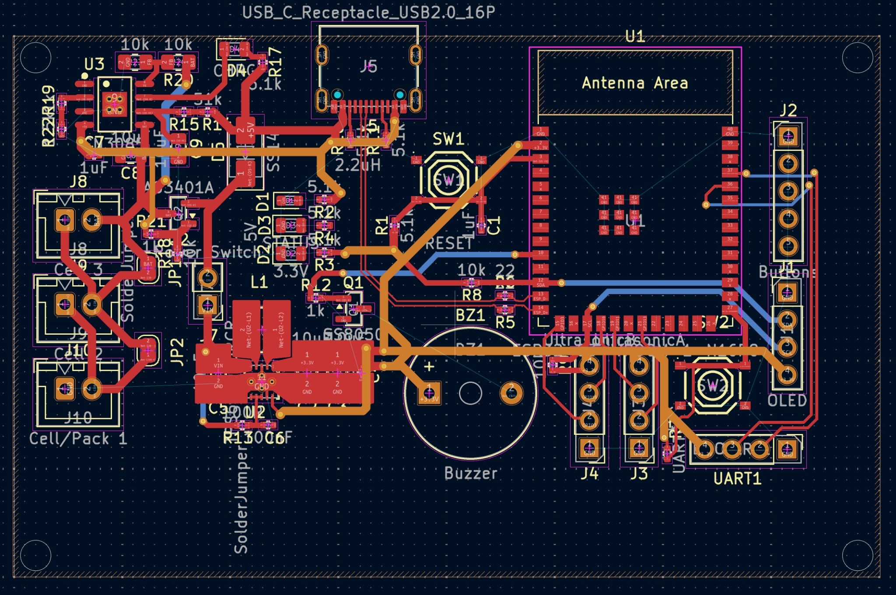
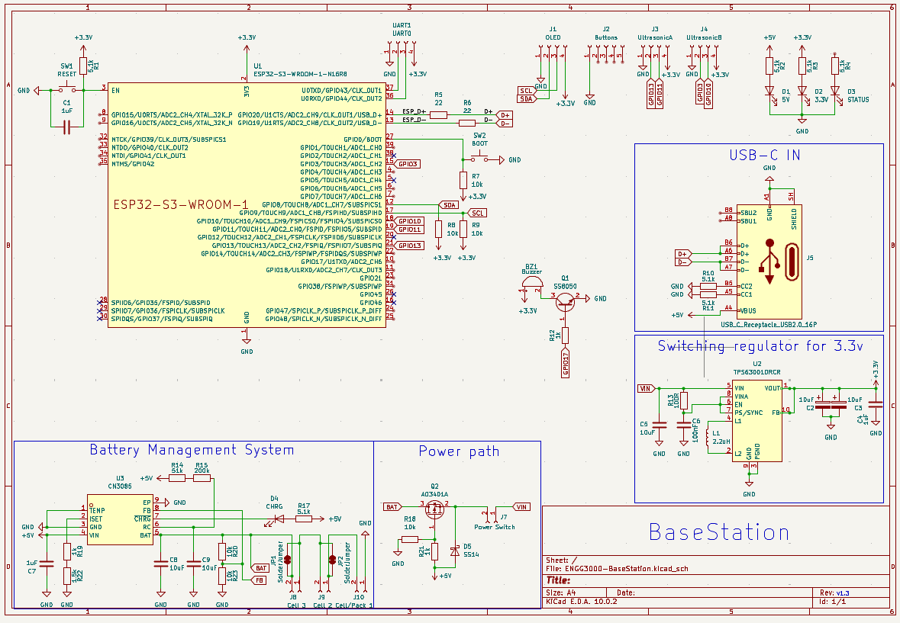

# 🛠️ ENG3000 — Scrum Minutes: Week 5

## Project Overview
- **Project name:** Whack a moll
- **Course:** ENG3000
- **Sprint / Week #:** 5
- **Minute Taker:** Alleluya Hamisi

## Attendance
| Name                    | Student ID | Discipline | Role This Week | Attendance (P/A) |
| ----------------------- | ---------- | ---------- | -------------- | ---------------- |
| Alleluya Hamisi (Alley) | 48455032   | SE         | Minutes Taker  | p                |
| Matthew Thompson        | 48234559   | SE         | Engineer       | p                |
| Fouad Ayoub             | 48421650   | SE         | Engineer       | p                |
| Cammilus John Baptist   | 48322288   | EE         | Scrum Master   | p                |
| Shreenidhi Arunachalam  | 48552453   | SE         | Engineer       | P                |

## Scrum Board Snapshot

| Task ID                    | No. Subtasks | Project Status                                              | Issues / Solution                                                                                                                                              | Assignee                |
| -------------------------- | ------------ | ----------------------------------------------------------- | -------------------------------------------------------------------------------------------------------------------------------------------------------------- | ----------------------- |
| UI Upgrade                 | 6            | 3 subtask done  3 Subtask in progress                 | The initial design was to input PNG mole, but instead, a CSS design was selected due to lower response and render times.                                       | Fouad  Shreenidhi |
| Hardware Optimisation      | 5            | 1 partially complete   4 Subtask newly created        | After input regarding the triangulation, Matthew came up with a new approach that should outperform conventional triangulation.                                | Matthew                 |
| Backend Overhaul           | 7            | 2 sub tasks in progress  5 sub tasks complete         | I proposed transitioning from a single file to a hybrid of microservices and state machines to address slow backend performance and make debugging easier.  | Alley                   |
| Main PCB                   | 4            | 4 newly created subtasks                                    | The PCB project has been split up to ensure it encompasses not just the chip but also the boxes, lights and sound.                                             | Cammilus                |
| Gather Sensor & Esp32 Data | 3            | 3 sub task put on pause until backend and hardware is ready | This was put on hold until all tasks are ready for testing.                                                                                                    | Alley & Matthew         |

## Sprint Complete Tasks (subtasks committed this sprint)
| Sub Task                       | Main Task             | Estimation (days) | Assignee   | Done?                                        |
| ------------------------------ | --------------------- | ----------------- | ---------- | -------------------------------------------- |
| Add Different Type of Moles    | UI Upgrade            | 7                 | Shreenidhi | Done                                         |
| Added Progress Bar (per Level) | UI Upgrade            | 7                 | Fouad      | Particialy fixed, will need to be overhauled |
| OVerhauled architecture        | Backend Overhaul      | 7                 | Alley      | Done                                         |
| Seperate API Fetch             | Backend Overhaul      | 7                 | Alley      | Done                                         |
| Added Multi Core Calculations  | Hardware Optimisation | 14                | Matthew    | Partially done, although it can be improved  |

## Meeting Notes
The client highlighted flaws in our system and team collaboration this included:
1. Limited cross-department knowledge (not all members voiced their opinions or responded)
2. Limited knowledge regarding the software and hardware
3. Limited testing parameters
4. Lack of sensing when attempting to step on holes 6 & 5
5. Lack of visual appeal (no animations, changing environments)
6. No PCB component only a design and sketch were present
7. No box for the sensors
8. No implementation of triangulation

Although we received a mark of 55, it was not reflective of our ability and showcased there were areas to improve upon to ensure we are meeting our desire for a high distinction.

### **FrontEnd**
This lead to Fouad & Shreenidhi working to improve the frontend to reflect an improvement to visual appeal.

Progress & Status bar:  

Status Bar:  

Freeze Mole:  

Gold Mole:  

Bomb Mole:  

Normal Mole:  

### **Backend:**
The backend has not yet connected the new mole designs and progress bars. Although the final microservice/statemachine concept has been completed and the foundational code for separate api fetch has been completed, it will need to be improved to encompass the new services.

### Hardware:
Matthew has completed the multicore calculations, although he is proposing that is can be improved upon. This is directed at eliminating concerns of no triangulations, instead introducing an improved variation using multinational.

**Converting the echo into distance:**  

It assumed that based on your echo were able to estimate the distance the human is located.

**SENSOR_SCALE** currently contains three ones and SENSOR_OFFSET_M contains three zeros:  

**Find Position of 2 Sensors:**  

This helps the sensor detect its position without reporting.

The circle intersection calculation:  

### Electrical:
There was a finalised PCB and sketch for the PC, while also some components were 3D printed to allow the sensors to be able to detect more accurately.

**PCB V1**  

**Sketch V1**  

## Sprint Retrospective
- What went well:
	- We were able to get the MVP complete before the testing & were able to ensure everyone submitted their report
- What to improve:
	- We need to improve our entire project to meet our desired mark requirement of HD
	- We need to conduct more testing and document it more
- Support needed from other members:
	- not applicable this week

## Next Meeting
- **Date:** 04/09/2026
- **Location/Platform:** Discord