---
tags:
	- eng3000
	- minutes
	- scrum
date: 2026-09-04
sprint: Week 6
minute_taker: Alleluya Hamisi
---

# 🛠️ ENG3000 — Scrum Minutes: Week 6

## Project Overview
- **Project name:** Whack a moll
- **Course:** ENG3000
- **Sprint / Week #:** 6
- **Minute Taker:** Alleluya Hamisi

## Attendance
| Name                    | Student ID | Discipline | Role This Week | Attendance (P/A) |
| ----------------------- | ---------- | ---------- | -------------- | ---------------- |
| Alleluya Hamisi (Alley) | 48455032   | SE         | Minutes Taker  | p                |
| Matthew Thompson        | 48234559   | SE         | Engineer       | p                |
| Fouad Ayoub             | 48421650   | SE         | Engineer       | p                |
| Cammilus John Baptist   | 48322288   | EE         | Engineer       | p                |
| Shreenidhi Arunachalam  | 48552453   | SE         | Scrum Master   | P                |

## Scrum Board Snapshot  
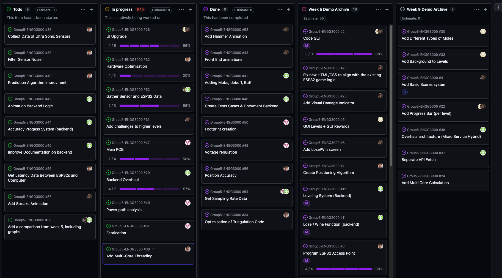

| Task ID                    | No. Subtasks | Project Status                                    | Issues / Solution                                                                                                                                                                                                                                                  | Assignee                |
| -------------------------- | ------------ | ------------------------------------------------- | ------------------------------------------------------------------------------------------------------------------------------------------------------------------------------------------------------------------------------------------------------------------ | ----------------------- |
| UI Upgrade                 | 6            | 4 subtask done  2 Subtask in progress       | There was an issue regarding the hammer require the team to go back and rework the hammer and animation. While there were minor issues with animation as a whole when connecting with the new services, but this was due to the services being changed frequently. | Fouad  Shreenidhi |
| Hardware Optimisation      | 5            | 3 subtask completed  2 Subtask in progress  | Matthews task was initially thought to be a bit smaller, but upon reflection, we have decided to extend his components as they are rather complex and time-consuming.                                                                                              | Matthew                 |
| Backend Overhaul           | 7            | 4 subtasks complete  3 Subtasks in progress | There was an issue with the transition, as new CSS and HTML components would cause merge conflicts or no longer work with the backend. This was resolved by splitting the branch and only using the old CSS & HTML before merging them all together in week 7.  | Alley                   |
| Main PCB                   | 4            | 2 subtasks complete  2 in progress          | The PCB project has been split up to ensure it encompasses not just the chip but also the boxes, lights and sound.                                                                                                                                                 | Cammilus                |
| Gather Sensor & Esp32 Data | 3            | 1 test collected  2 need to be completed    | There was distance data collected with the assistance of the whole team.                                                                                                                                                                                           | Whole Team              |

## Sprint Completed Tasks (subtasks committed this sprint)
| Sub Task                                | Main Task                  | Estimation (days) | Assignee        | Done?                                |
| --------------------------------------- | -------------------------- | ----------------- | --------------- | ------------------------------------ |
| Add Backgrounds to levels (1, 2 & 3)    | UI Upgrade                 | 7                 | Shreenidhi      | Done                                 |
| Add hammer Animation                    | UI Upgrade                 | 7                 | Fouad           | Done & fixed                         |
| Frontend Animation                      | UI Upgrade                 | 7                 | Fouad           | Done                                 |
| Create Testcases & Documentation        | Backend Overhaul           | 7                 | Alley           | Done                                 |
| Adding mobs, debuff and buff            | Backend Overhaul           | 7                 | Alley           | Done                                 |
| Seperate API Fetch                      | Backend Overhaul           | 7                 | Alley           | Done                                 |
| Added Multi Core Calculations           | Hardware Optimisation      | 21                | Matthew         | Expended duration                    |
| Positioning Accuracy                    | Hardware Optimisation      | 7                 | Matthew         | Done & Tested                        |
| Optimisation of Triagulation Code       | Hardware Optimisation      | 7                 | Matthew         | Done but waiting for further testing |
| Voltage Regulation                      | Main PCB                   | 14                | Camillus        | Done                                 |
| Foot Print Creation                     | Main PCB                   | 14                | Camillus        | Done                                 |
| Gather Sample Rate (Backend & Hardware) | Hardware Optimisation      | 7                 | Matthew & Alley | Done                                 |
| Gather Distance Data                    | Gather Sensor & Esp32 Data | 7                 | Whole Team      | Done                                 |

## Meeting Notes
This week we did the most amount of work due to the fact their is conflicting schedule requirements for assignments for the following week leaving minimal time for major improvements in the following week.

Instead, we focused on making the code ready to be completed this week as much as possible and only having to test and print the required components.

### **FrontEnd**
They introduced new backgrounds while also adding animation to said background. There was a minor issue as the hammer was not displaying correctly, so the front-end team was focused on improving said animations & design conflicts.

IceAge Background:  
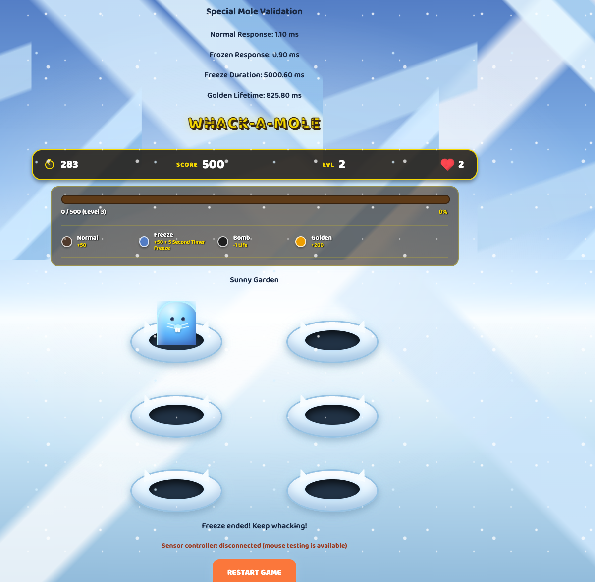

Fire Background:  
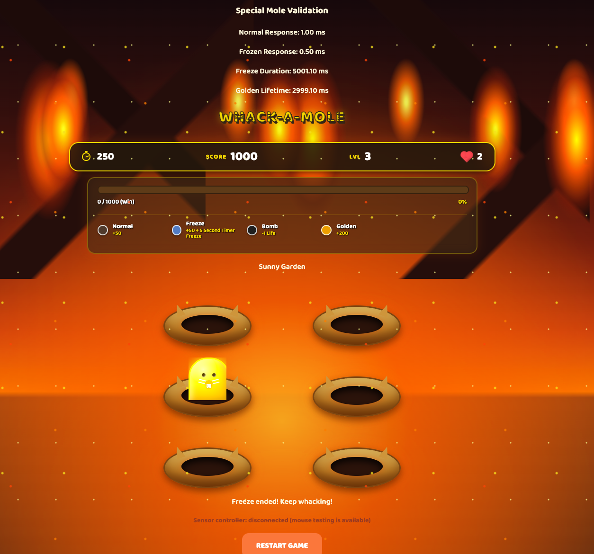

Hammer:  
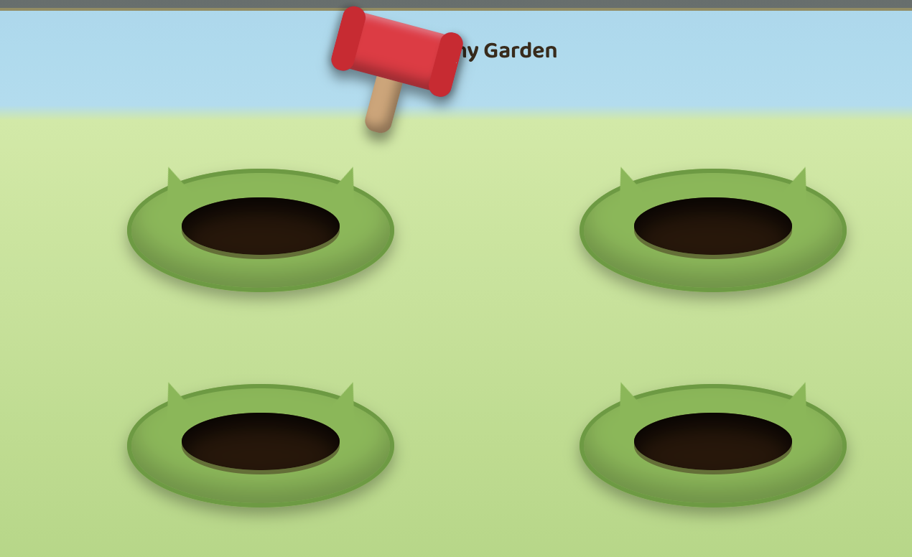

### **Backend:**
There was a major system overhaul, this required a large amount of unit and simulation script testing to test that each function being introduced is working as intended. These tests highlighted the transition was the best choice, although this has not been integrated with the new multilateral and the Frontend Components.

Monolithic VS Services Simulation Script:  
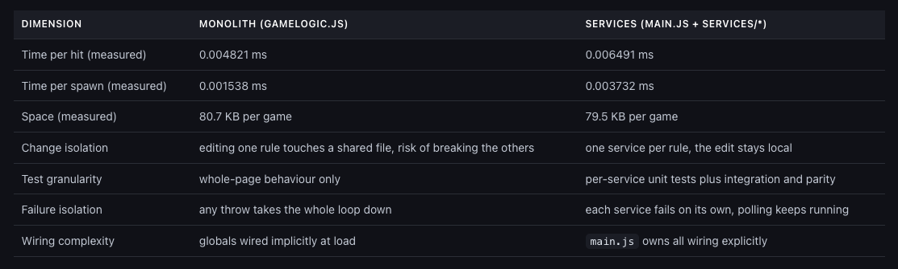

Sensor Polling Speed Simulation Script:  
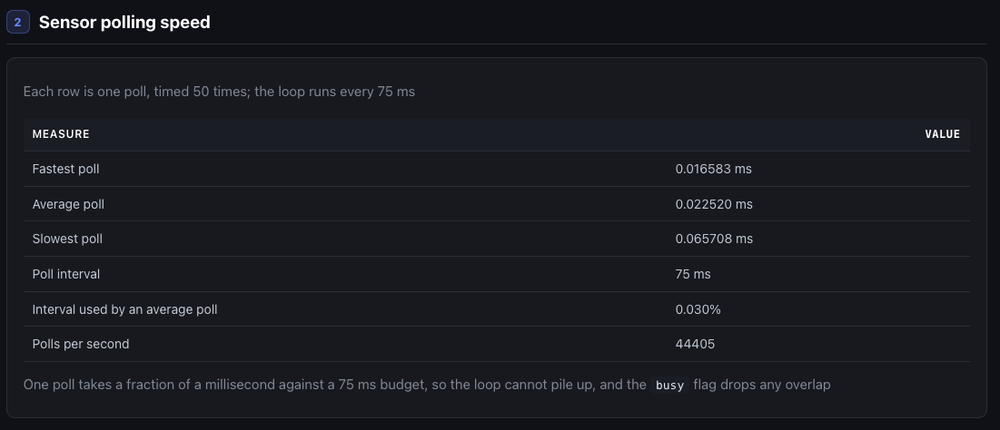

Connection Handling Unite Test:  
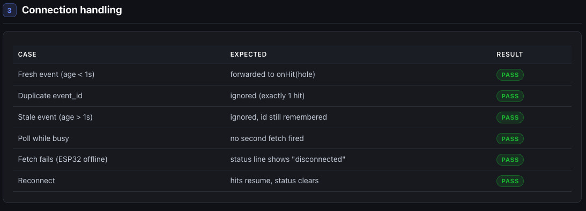

### Hardware:
Matthew has expanded on his multilateral designs, he has also begun creating a Word document to ensure that the rest of the team is able to comprehend the math related to multilateral.

The new components included:

**Prediction Range & Compare Measurements**  
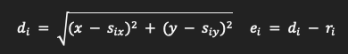

**Reducing Influence of unusual echo's**  
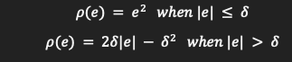

**Iteratively improving the coordinates**  
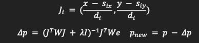

**Checking the final fit**  
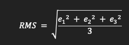

Distance Accuracy Testing:  
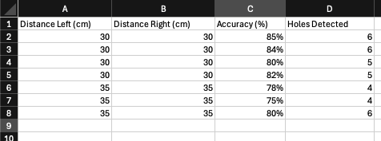

### Electrical & Tests:
We were able to test out the batteries this week and have a prototype of the boxes that might be used for the Week 9 demo if tests are positive.

**First Version Prototype**  

Long Distance (200, 350, 500) Testing:  
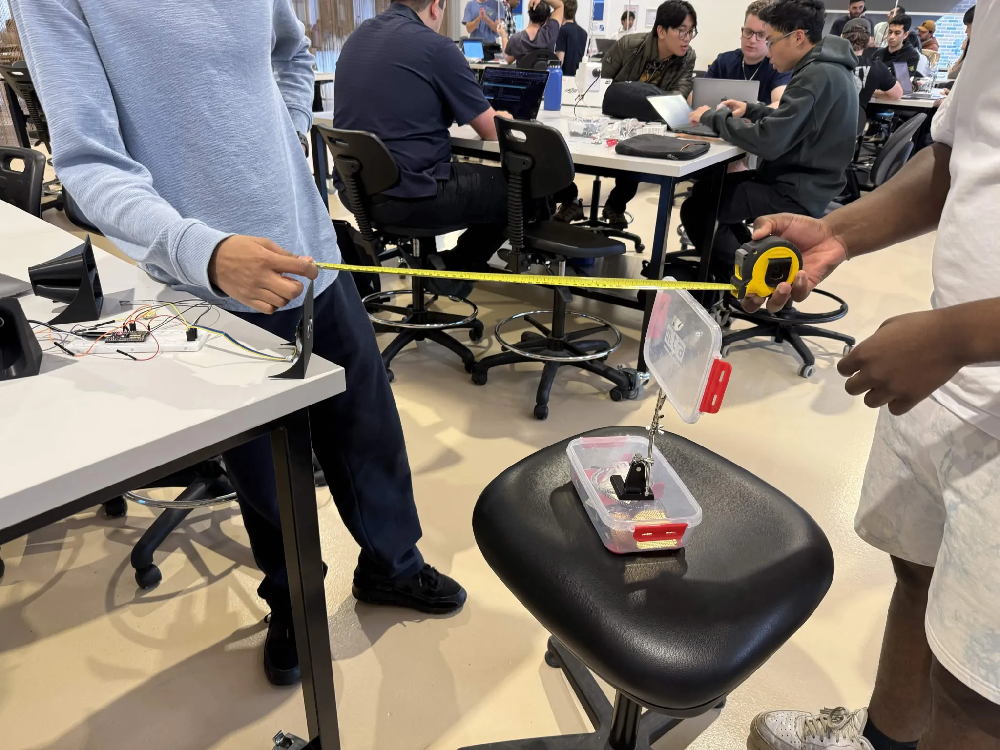

(300cm):  

(500cm):  
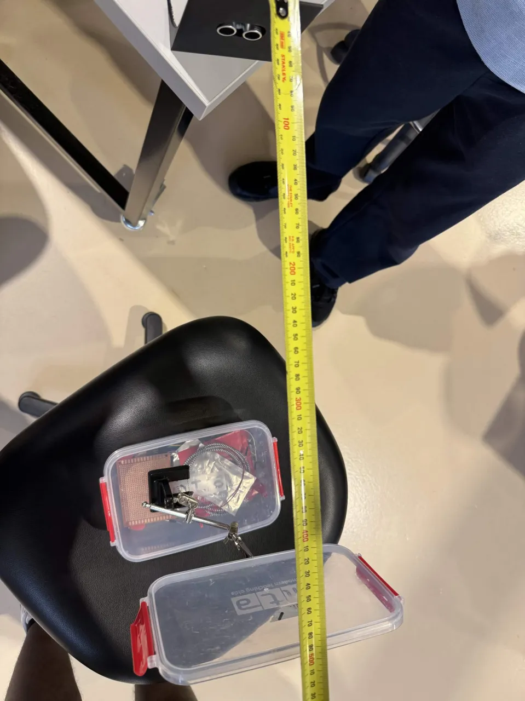

Short Distance Testing 2:  
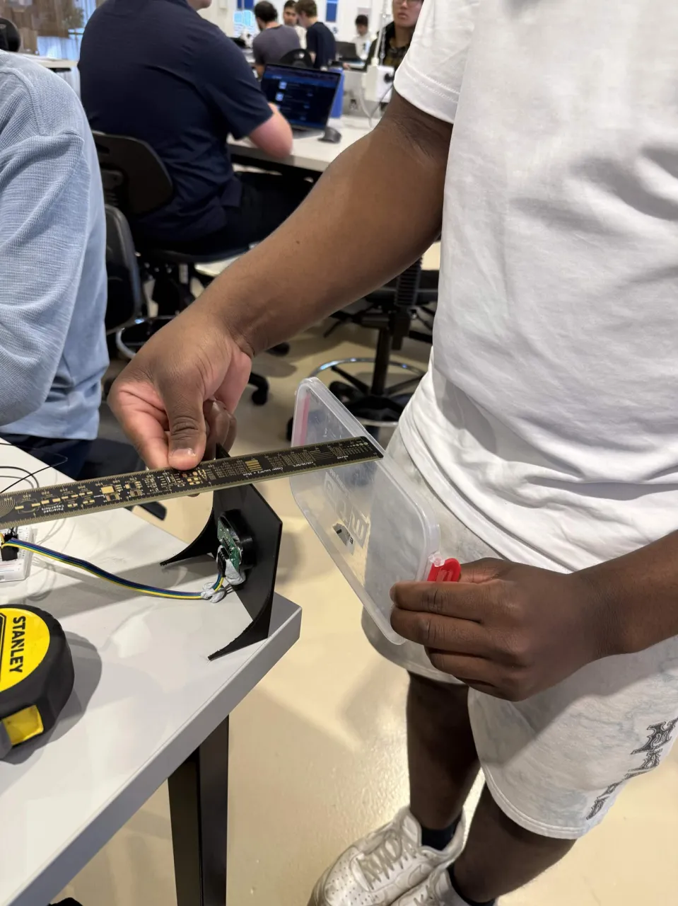

(10 cm warning too close):  

## Sprint Retrospective
- What went well:
	- We were able to do very good time management this week to ensure everyone did a major push for the final demo and only left a minimal amount of tests and final touches
- What to improve:
	- We will need to integrate all the components, which may require all members to be available even with conflicting priorities relating to assignments
- Support needed from other members:
	- All members have highlighted the risk of needing extensions due to assignment deadlines

## Next Meeting
- **Date:** 11/09/2026
- **Location/Platform:** Discord