# 🛠️ ENG3000 — Scrum Minutes: Week 7

## Project Overview
- **Project name:** Whack a moll
- **Course:** ENG3000
- **Sprint / Week #:** 7
- **Minute Taker:** Alleluya Hamisi

## Attendance
| Name                    | Student ID | Discipline | Role This Week | Attendance (P/A) |
| ----------------------- | ---------- | ---------- | -------------- | ---------------- |
| Alleluya Hamisi (Alley) | 48455032   | SE         | Minutes Taker  | p                |
| Matthew Thompson        | 48234559   | SE         | Engineer       | p                |
| Fouad Ayoub             | 48421650   | SE         | Scrum Master   | p                |
| Cammilus John Baptist   | 48322288   | EE         | Engineer       | p                |
| Shreenidhi Arunachalam  | 48552453   | SE         | Engineer       | P                |

## Scrum Board Snapshot  
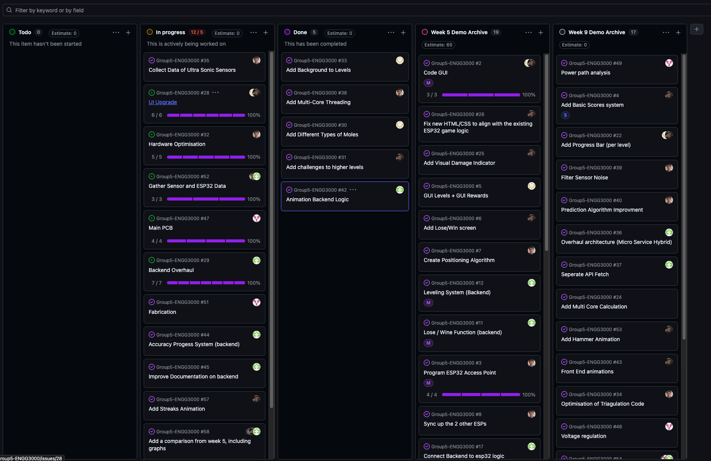

| Task ID                    | No. Subtasks | Project Status                                       | Issues / Solution                                                                                                                                                                                                                                                  | Assignee                |
| -------------------------- | ------------ | ---------------------------------------------------- | ------------------------------------------------------------------------------------------------------------------------------------------------------------------------------------------------------------------------------------------------------------------ | ----------------------- |
| UI Upgrade                 | 6            | 4 subtask done  2 Subtask in progress          | There was an issue regarding the hammer require the team to go back and rework the hammer and animation. While there were minor issues with animation as a whole when connecting with the new services, but this was due to the services being changed frequently. | Fouad  Shreenidhi |
| Hardware Optimisation      | 5            | 4 subtasks completed   1 Subtask in waiting | Matthews task was initially thought to be a bit smaller, but upon reflection, we have decided to extend his components as they are rather complex and time-consuming.                                                                                              | Matthew                 |
| Backend Overhaul           | 7            | 6 Subtasks complete  1 subtask in progress     | There was an issue with the transition, as new CSS and HTML components would cause merge conflicts or no longer work with the backend. This was resolved by splitting the branch and only using the old CSS & HTML before merging them all together in week 7.  | Alley                   |
| Main PCB                   | 4            | 3 subtasks complete  1 in progress             | The PCB project has been split up to ensure it encompasses not just the chip but also the boxes, lights and sound.                                                                                                                                                 | Cammilus                |
| Gather Sensor & Esp32 Data | 3            | 1 test collected  2 need to be completed       | There was distance data collected with the assistance of the whole team.                                                                                                                                                                                           | Whole Team              |

## Sprint Completed Tasks (subtasks committed this sprint)
| Sub Task                             | Main Task                  | Estimation (days) | Assignee   | Done?                                |
| ------------------------------------ | -------------------------- | ----------------- | ---------- | ------------------------------------ |
| Add Backgrounds to levels (1, 2 & 3) | UI Upgrade                 | 7                 | Shreenidhi | Extended due to merge bugs           |
| Frontend Animation                   | UI Upgrade                 | 7                 | Fouad      | Extended due to merge bugs           |
| Animation Backend Logic              | Backend Overhaul           | 7                 | Alley      | Done                                 |
| Migration                            | Backend Overhaul           | 7                 | Alley      | Done                                 |
| Added Multi Core Calculations        | Hardware Optimisation      | 21                | Matthew    | Done                                 |
| Filter Sensor Noise                  | Hardware Optimisation      | 7                 | Matthew    | Done & Tested                        |
| Prediction Algorithm                 | Hardware Optimisation      | 7                 | Matthew    | Done but waiting for further testing |
| Power Pathways                       | Main PCB                   | 14                | Camillus   | Done                                 |
| Sensor Detection Testing             | Gather Sensor & Esp32 Data | 1                 | Whole Team | Done                                 |

## Meeting Notes
This week was rather minimal for improvements due to deadlines, but we were able to begin fixing backend and frontend bug issues which occurred due to integration. While we were still able to do some more optimising and improving.

### **FrontEnd**
This was a minimal amount of changes this week due to the backend not working as intended as the backend has been overhauled and now is having migration issues like animations and classes not working or being called due to naming or new functions handling the logic.

Although we were able to add a new hammer:

New Hammer:  
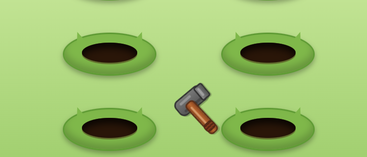

### **Backend:**
There was a lot of merging bugs and this was something that required both frontend and backend to work on this week. There were also bugs that occurred in the fetching of api data due to changes both on the ESP32 codebase and the backend.

Monolithic VS Services Simulation Script:  
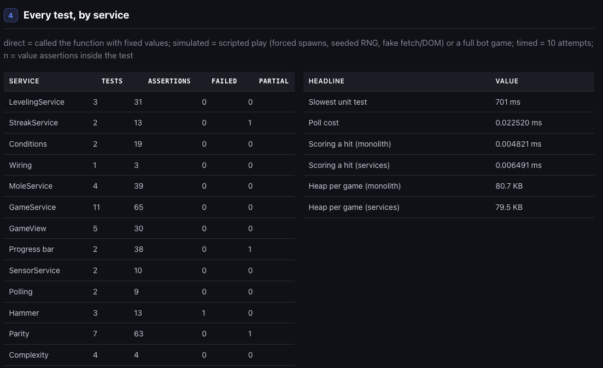

Task Speed Test Simulation Script:  
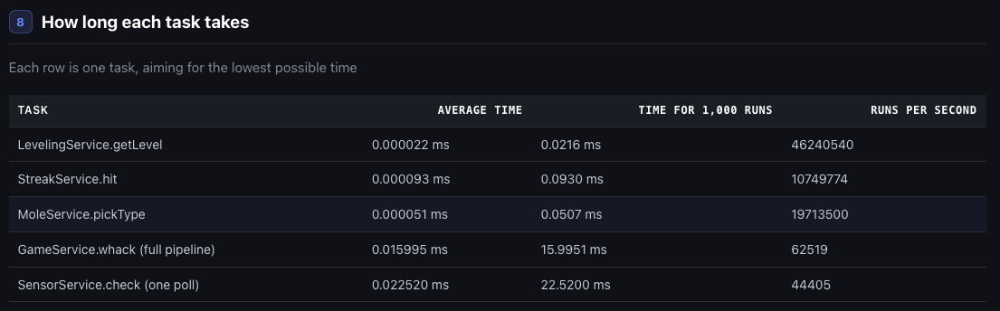

### Hardware:
Matthew completed most of the code and ensured before then assisting in fixing the bugs associated with the API fetch that occurred after the microservice went live.

**Useful Geometry Math**  
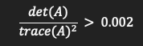

**Direction of the Weakest Position**  
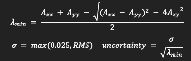

**Exponential Moving Average**  

**Turning Coordination into Mole Hit**  
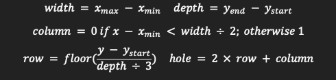

**6 hole sensor Testing**  
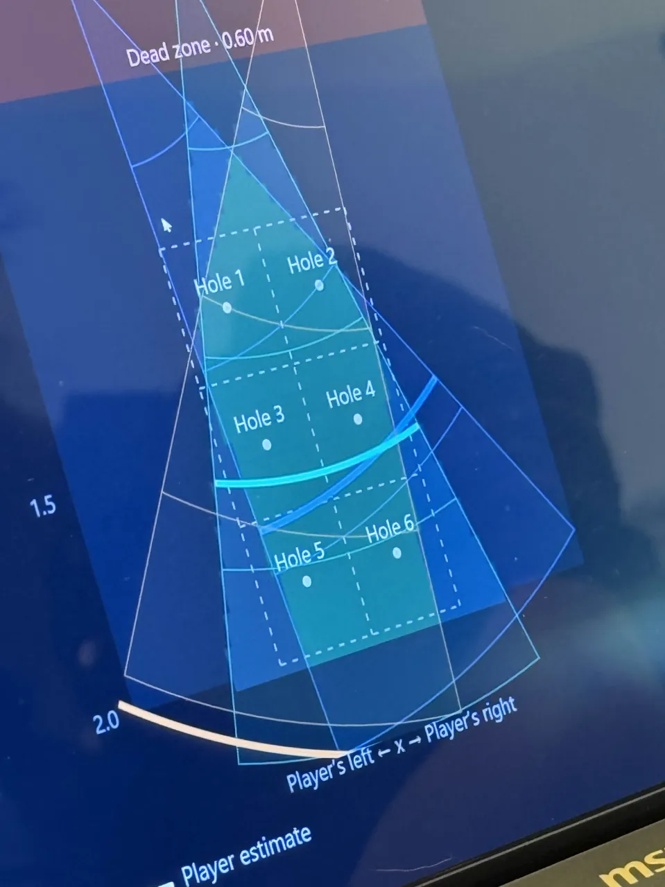

**Dead zone Testing**  

**Human Testing**  
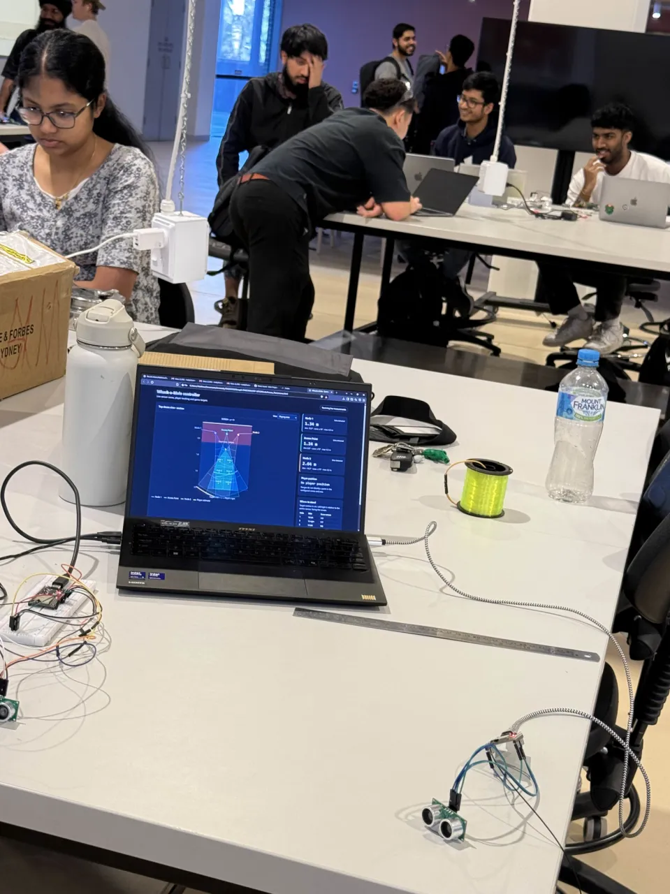

**Sensor Test Dashboard**  
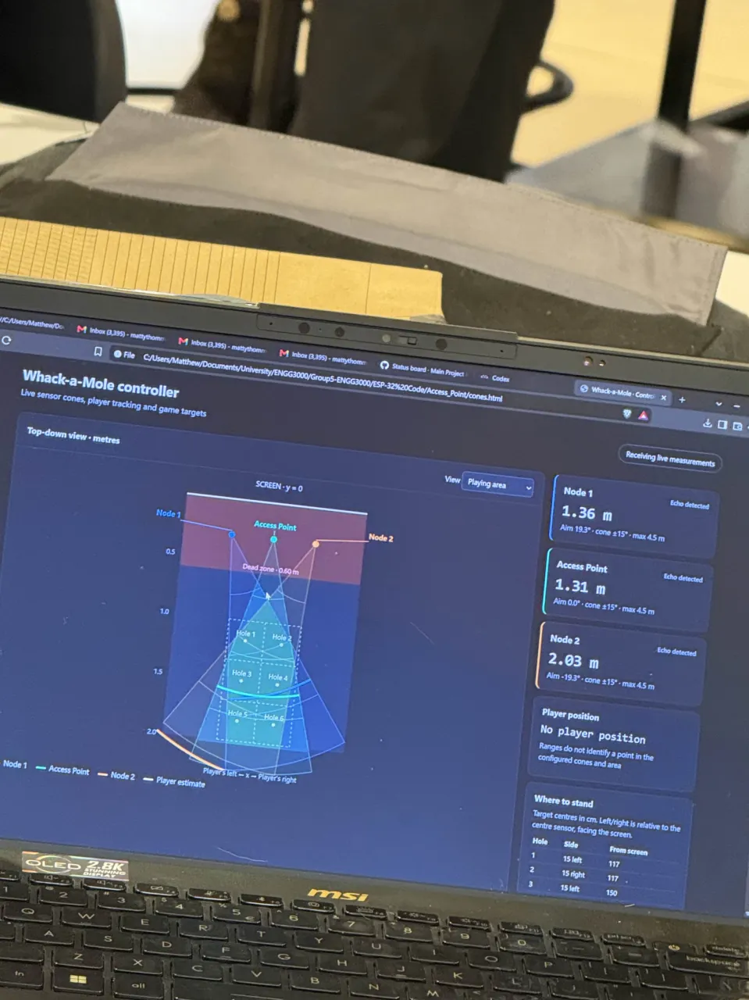

**Sensor Detecting Humans**  
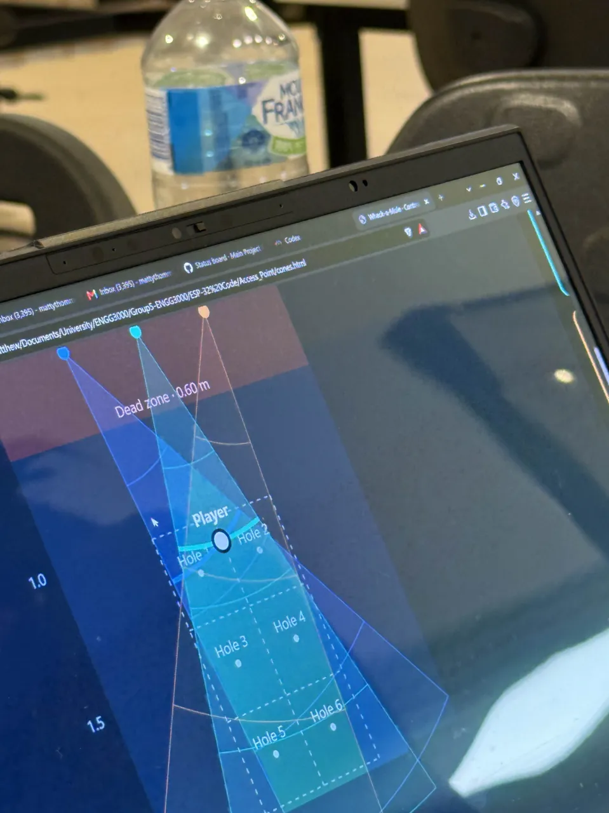

### Electrical:
This week, Cam placed the orders for the PCBs & improved the PCB & sketched a little to match the requirements of the PCB fabrication.

PCB:  
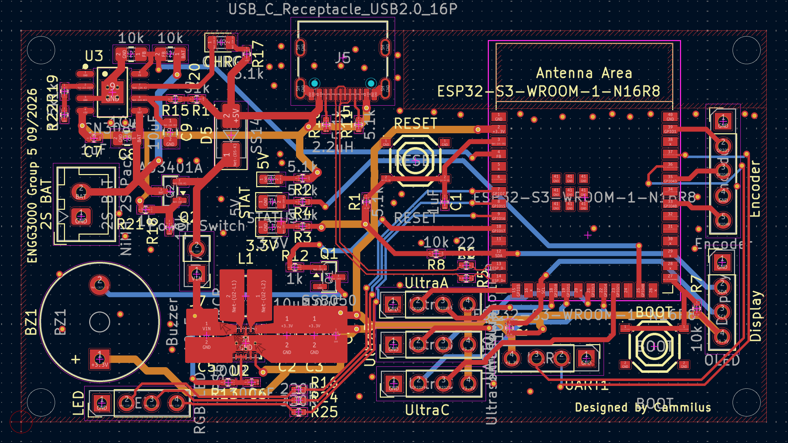

Sketch:  
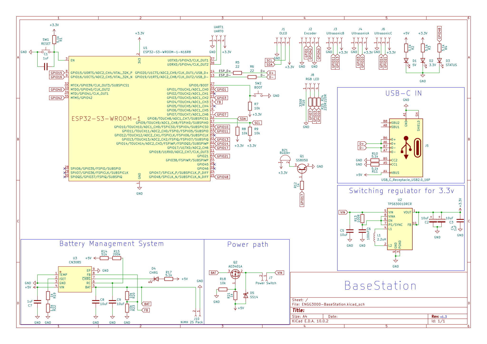

## Sprint Retrospective
- What went well:
	- We were able to do a lot more testing and troubleshooting, which could massively affect the testing and debugging phase of the project
- What to improve:
	- We will need more testing and comparing from week 5 demo version and how we were able to improve. Although we have data, we do not have graphs, tables or explanations indicating improvements
- Support needed from other members:
	- There were no concerns or requests other than Alley asking for people to notify him if there are any more troubleshooting issues, but the team has decided we will focus on assisting their specific service within the backend so that the backend has direct involvement from the other individuals

## Next Meeting
- **Date:** 18/09/2026
- **Location/Platform:** Discord