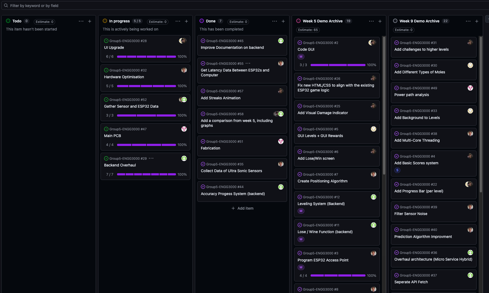
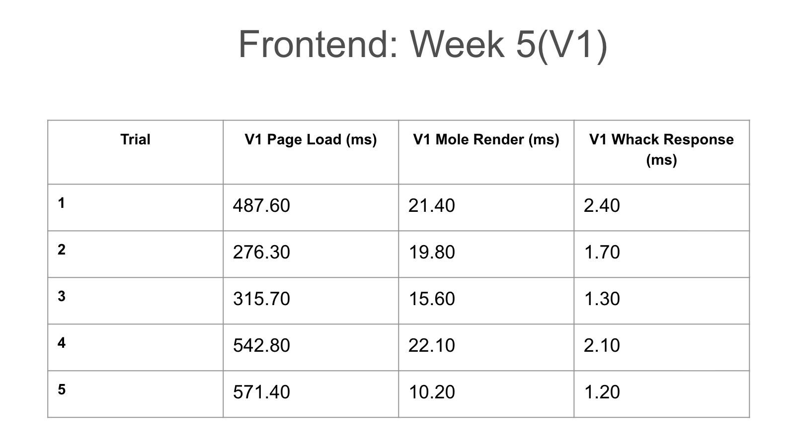
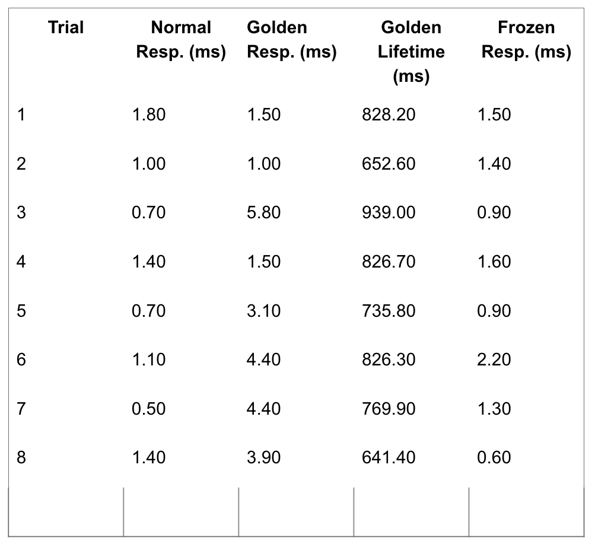
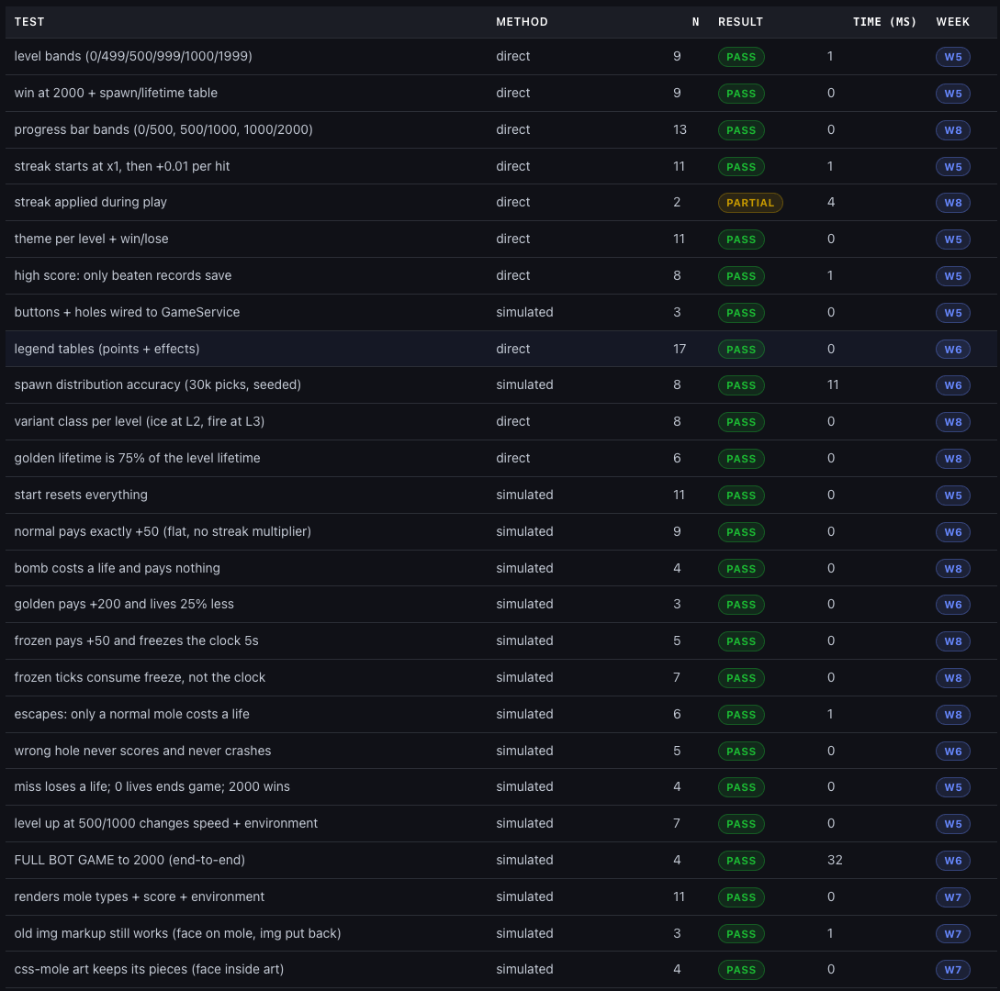
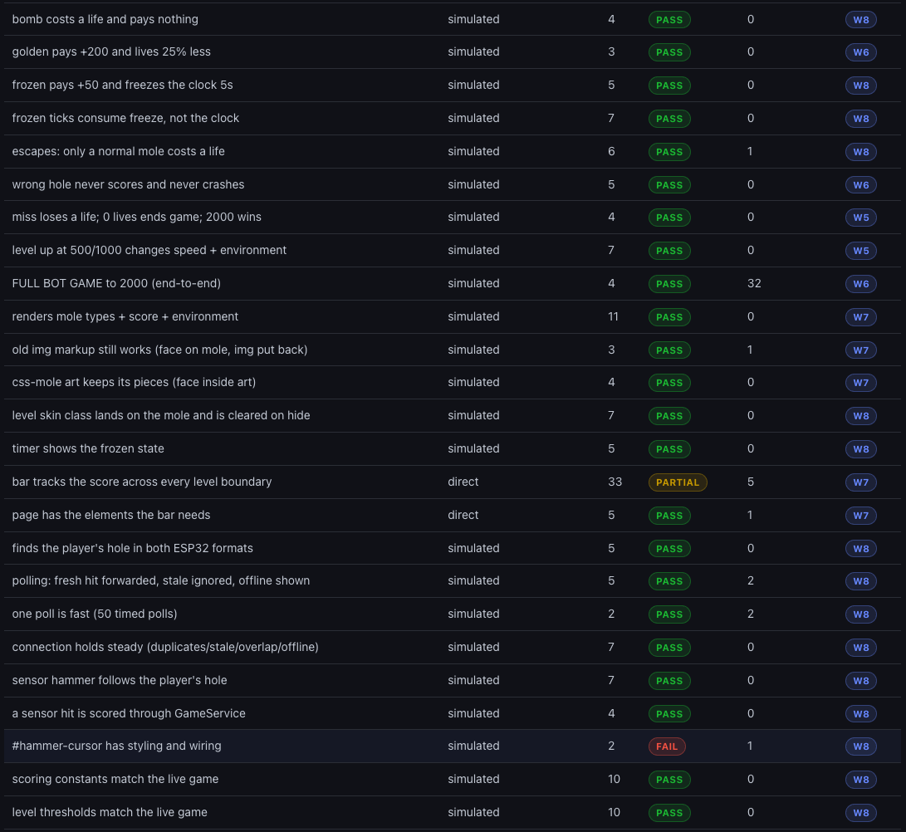
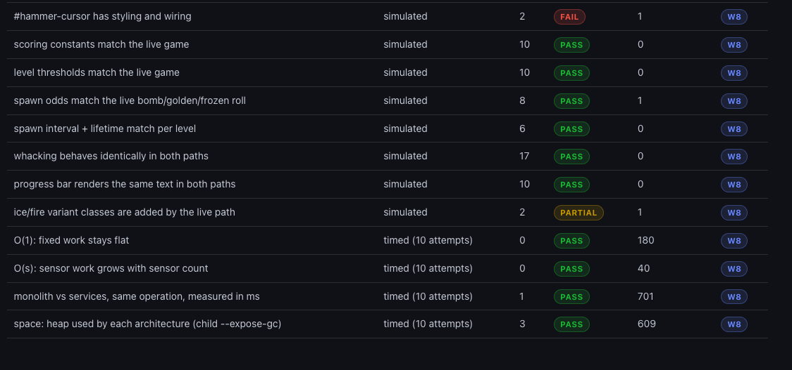
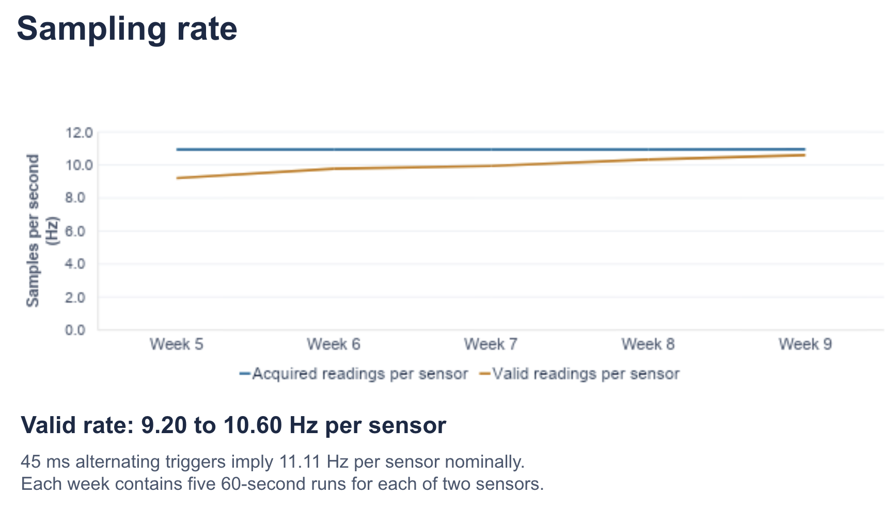
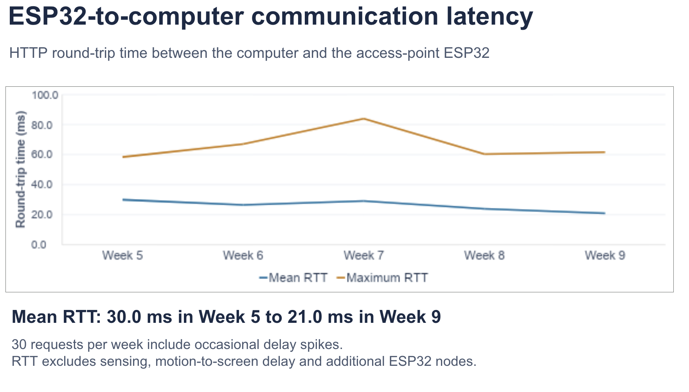
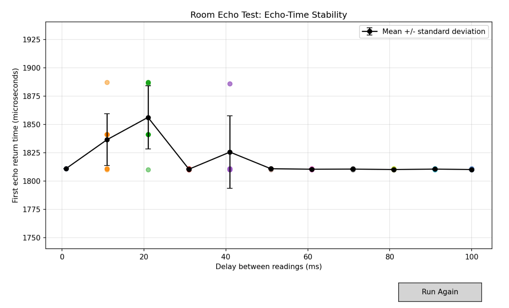

---
tags:
  - eng3000
  - minutes
  - scrum
date: 2026-09-18
sprint: Week 8
minute_taker: Alleluya Hamisi
---

# 🛠️ ENG3000 — Scrum Minutes: Week 8

## Project Overview
- **Project name:** Whack a moll
- **Course:** ENG3000
- **Sprint / Week #:** 8
- **Minute Taker:** Alleluya Hamisi

## Attendance
| Name                    | Student ID | Discipline | Role This Week | Attendance (P/A) |
| ----------------------- | ---------- | ---------- | -------------- | ---------------- |
| Alleluya Hamisi (Alley) | 48455032   | SE         | Minutes Taker  | p                |
| Matthew Thompson        | 48234559   | SE         | Engineer       | p                |
| Fouad Ayoub             | 48421650   | SE         | Scrum Master   | p                |
| Cammilus John Baptist   | 48322288   | EE         | Engineer       | p                |
| Shreenidhi Arunachalam  | 48552453   | SE         | Engineer       | P                |

## Scrum Board Snapshot  

| Task ID                    | No. Subtasks | Project Status       | Issues / Solution                                                                                                                                                                                                                                                  | Assignee                |
| -------------------------- | ------------ | -------------------- | ------------------------------------------------------------------------------------------------------------------------------------------------------------------------------------------------------------------------------------------------------------------ | ----------------------- |
| UI Upgrade                 | 6            | 6 subtask completed  | There was an issue regarding the hammer require the team to go back and rework the hammer and animation. While there were minor issues with animation as a whole when connecting with the new services, but this was due to the services being changed frequently. | Fouad  Shreenidhi |
| Hardware Optimisation      | 5            | 5 subtasks completed | Matthews task was initially thought to be a bit smaller, but upon reflection, we have decided to extend his components as they are rather complex and time-consuming.                                                                                              | Matthew                 |
| Backend Overhaul           | 7            | 7 sub tasks complete | There was an issue with the transition, as new CSS and HTML components would cause merge conflicts or no longer work with the backend. This was resolved by splitting the branch and only using the old CSS & HTML before merging them all together in week 7.  | Alley                   |
| Main PCB                   | 4            | 4 subtasks completed | The PCB project has been split up to ensure it encompasses not just the chip but also the boxes, lights and sound.                                                                                                                                                 | Cammilus                |
| Gather Sensor & Esp32 Data | 3            | 3 test collected     | There was distance data collected with the assistance of the whole team.                                                                                                                                                                                           | Whole Team              |

## Sprint Completed Tasks (subtasks committed this sprint)
| Sub Task                                        | Main Task                  | Estimation (days)                 | Assignee           | Done?                                                      |
| ----------------------------------------------- | -------------------------- | --------------------------------- | ------------------ | ---------------------------------------------------------- |
| Add streaks                                     | UI Upgrade                 | 7                                 | Fouad & Shreenidhi | currently not working and may be delegated to week 12 demo |
| Add Frontend Testing UI (new task)              | UI Upgrade                 | 7                                 | Fouad & Shreenidhi | Extended due to merge bugs                                 |
| Improve Documentation (Backend)                 | Backend Overhaul           | 7                                 | Alley              | Done                                                       |
| Accuracy Progress system                        | Backend Overhaul           | 7                                 | Alley              | Done                                                       |
| Get latency Data Between ESP32 & Computer       | Hardware Optimisation      | 7                                 | Matthew            | Done & Tested                                              |
| Collect Data for Ultra Sonic Sensors            | Hardware Optimisation      | 7                                 | Matthew            | Done but waiting for further testing                       |
| Finish Ordering PCB & Printing Boxes (new Task) | Main PCB                   | 14 (to arrive by week 2 of break) | Camillus           | Done                                                       |
| Demo Testing                                    | Gather Sensor & Esp32 Data | 1                 | Whole Team         | Done                                                       |

## Meeting Notes
Due to the fact that some members will be unable to meet in the holidays as they're going away, this meant we needed to ensure that it was as demo-ready as possible, with only needing light touch-ups if needed in the holidays or early week 9.

### **FrontEnd**
This week the frontend team focused on conducting tests and improving animation performance to ensure that it all works and is ready for the demo.

Week 5 Data:  

Testing Data:  

### **Backend:**
This week the focus was on testing and ensuring there is enough evidence to support the improvement compared to monolithic.

Unit Testing Data Collected since week 5:  

  

  

### Hardware:
There were a few tests that were run, and there are still more, but these are the overall tests that relate to everyone else.

**Sampling Rate:**  

**ESP32 To PC**  

**Echo Stability**  

## Next Meeting
- **Date:** 09/10/2026
- **Location/Platform:** Discord